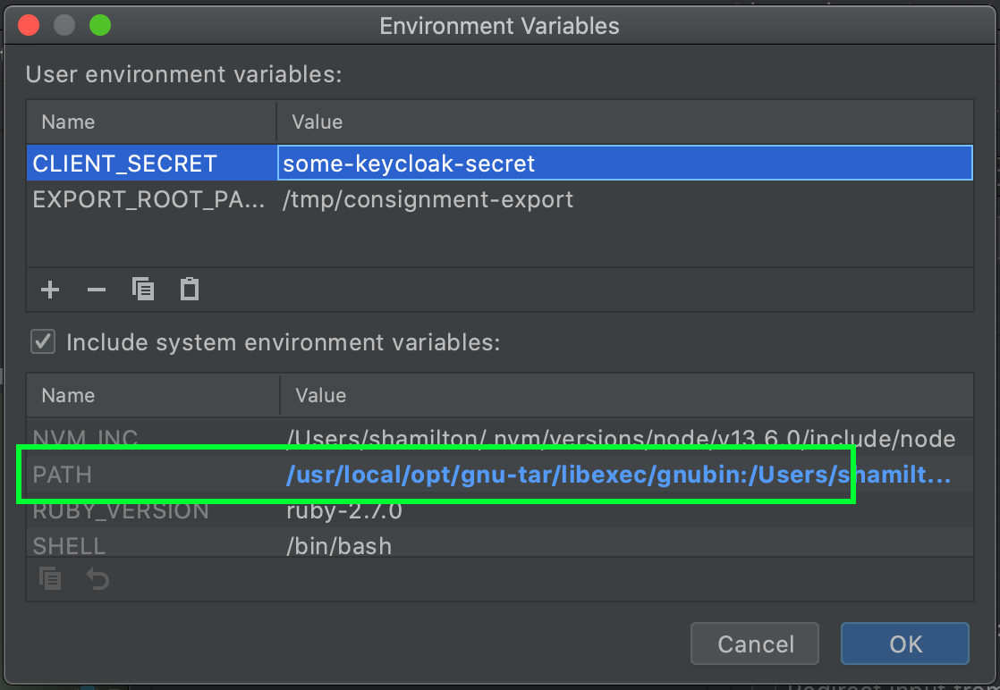

## Consignment Export
This is the project which contains the code for the consignment export. 

The infrastructure for the export, is defined in the [terraform]("https://github.com/nationalarchives/tdr-terraform-environments") repository.
* The front end makes a request to the api gateway with the user's token.
* A lambda authorises the request using the consignment api to check the token
* Api gateway triggers a step function
* The step function triggers an ECS task which runs the code in this repository.

There are two modules in this repository.

The bagit-export module does the following:

* Calls the API to get a list of files
* Downloads the files from S3 to the EFS volume
* Creates the Bagit bag
* Tar and zip the bag
* Create a checksum file for the tar file
* Upload to the export bucket.
* Update the API with the export location

The export module does the following:
* Copies the files for a given consignment from the clean bucket to the export bucket
* For each file, it reads the metadata from the FileMetadata and ConsignmentMetadata tables. 
* It then reads the transferring body name and consignment reference.
* The metadata, body name and reference are written to a json object in a file name <uuid>.metadata in the same bucket.

The code for the authoriser is in the [tdr-consignment-export-authoriser](https://github.com/nationalarchives/tdr-consignment-export-authoriser) project


### Running Locally

Set the `CLIENT_SECRET` environment variable to the client secret for the tdr-backend-checks Keycloak client in the integration environment, which you can find by logging into Keycloak or by running the AWS CLI with intg credentials:

```
aws ssm get-parameters  --names "/intg/keycloak/backend_checks_client/secret"  --with-decryption
```

Set the `EXPORT_ROOT_PATH` environment variable to a path on your machine which the task can use to download files and prepare the Bagit package. For example, `/tmp/consignment-export`.

You can then run the Main object in Intellij as you can with any similar project. You will need to provide the program arguments: `export --consignmentId {a uuid}`

You can also run `sbt universal:packageZipTarball` which creates a file `target/universal/tdr-consignment-export.tgz` which, when unzipped, gives you a `bin/tdr-consignment-export` executable which you can run with the same arguments as above. This is how the docker container runs the file so is the closest to running this in production.

### Release notes
We are now releasing new versions to github and for this we need release notes. 

Release notes will be auto generated based on the commit messages since the last branch 

### Deployment
There are multiple steps to the release process. On a merge to master:
* The tests are run as they are for all branches
* The version in `version.sbt` is incremented to the next non snapshot version
* Two tar.gz files are created, one for the export module and one for the bagit-export module.
* Release notes are added. See the release notes section for more detail.
* A release is created in GitHub with the release notes and both zip files are uploaded.
* The new version and the released notes are pushed to a branch and a pull request raised.
* The docker image is built, using the latest zip files from GitHub
* The docker image is tagged using the latest version from `version.sbt` and pushed to ECR
* The docker image is tagged with intg and pushed to ECR
* The release branch is created.


To deploy to staging/production, you need to run the [deploy](https://github.com/nationalarchives/tdr-consignment-export/actions/workflows/deploy.yml) GitHub action with the stage and the <em>docker version number</em>, not the code version number. The docker version will be a git tag on the branch.

### Tests

The export module tests need a docker container to run the tests against.

```shell
docker build -f Dockerfile-tests -t tests .
```

Run `sbt tests` to run the tests in both projects.

The exporter tests write temporary files to the directory defined in `efs.rootLocation` in the test application.conf. By default, it uses the `/tmp` directory. To use a different directory, set the `SCRATCH_DIRECTORY` environment variable when running the tests.

### Troubleshooting

You might see this error if your `tar` installation is not GNU Tar, since some Unix OSes like MacOS use a different `tar` by default:

```
tar: Option --sort=name is not supported
```

You can fix this by installing GNU Tar and making sure it is on your path when you run the project.

On a Mac with Homebrew:

* Run `brew install tar`
* Add `/usr/local/opt/gnu-tar/libexec/gnubin:`, to the **beginning** of your `PATH` environment variable so that Scala can run the GNU version of tar. If you're  doing this in IntelliJ, it looks like this:


